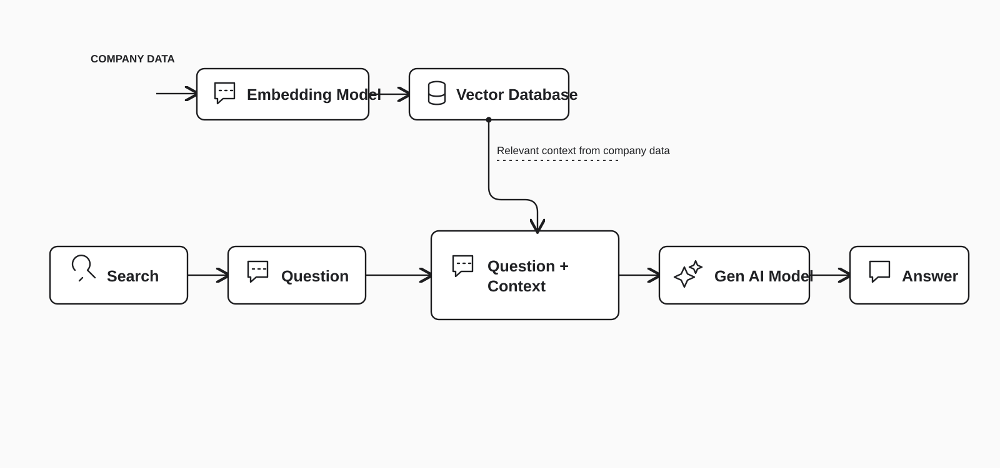

<div align="center">


# W5 RAG · Chat with your own knowledge

**A small, readable Python workshop project for turning documents and web pages into a searchable chatbot.**

Use APIYI to embed your documents, store and retrieve passages with Pinecone, and answer with `gpt-4.1-nano` through APIYI.

[Get started](#quick-start) · [Full run guide](docs/RUN_GUIDE.md) · [Function-by-function reference](docs/RUN_GUIDE.md#function-reference) · [Troubleshooting](docs/RUN_GUIDE.md#troubleshooting)

</div>

---

## What you can do

| Action | What happens |
| --- | --- |
| `ingest_files()` | Reads PDF, TXT, and Markdown files from a local folder, chunks their text, embeds the chunks, and stores them in Pinecone. |
| `scrape_website()` | Sends a public URL through Jina Reader, then chunks and stores the returned text. |
| Ask a question | Embeds the question, retrieves up to three matching chunks, and sends them with the question to the chat model. |
| `clearDB()` | Deletes every vector in the configured Pinecone **namespace** after an explicit confirmation. |

The interface is a **terminal chatbot**. The dependency list contains only packages the script imports; this repository does not start a web server.

## How it works



1. **Prepare knowledge.** A file or public web page becomes text. `chunk_text` makes overlapping passages, and APIYI converts each passage into an embedding.
2. **Store it.** Pinecone stores the vector with its source name and original passage.
3. **Ask.** The question gets an embedding of the same size. Pinecone returns the nearest passages; the chat model answers using them as context.

The model can still make mistakes. Inspect important answers against the original source. This starter does not print citations or a confidence score.

## Quick start

You need **Python 3.9 or newer**, an [APIYI API key](https://docs.apiyi.com/getting-started), and a [Pinecone API key](https://app.pinecone.io/). You do not need an OpenAI API key. API usage may be billed by APIYI and Pinecone; the guide explains cost and data handling before you ingest material.

```bash
git clone https://github.com/Yashnm2/W5-RAG-chatbot.git
cd W5-RAG-chatbot
python3 -m venv .venv
source .venv/bin/activate
python -m pip install -r requirements.txt
cp .env.example .env
```

Edit `.env` and replace `your_apiyi_api_key_here` and `your_pinecone_api_key_here` with your own keys. Then:

```bash
python "[Lodge_Lab] Starter.py"
```

When the `You:` prompt appears, put a `.pdf`, `.txt`, or `.md` file in a folder named `Files to insert (PDF or TXT)`, then type `ingest_files()`. For a quick first test, copy [`examples/sample-knowledge.txt`](examples/sample-knowledge.txt) into that folder and ask: **When is the workshop library open?**

Windows activation commands, a complete first-run walkthrough, configuration options, and recovery steps are in the [run guide](docs/RUN_GUIDE.md).

## Configuration at a glance

| Variable | Default | Purpose |
| --- | --- | --- |
| `APIYI_API_KEY` | Required | Embeddings and chat requests through APIYI. |
| `PINECONE_API_KEY` | Required | Index creation, storage, retrieval, and deletion. |
| `PINECONE_INDEX` | `my-first-rag` | Index to connect to or create. |
| `PINECONE_CLOUD` / `PINECONE_REGION` | `aws` / `us-east-1` | Location used **only when creating** a new index. |
| `PINECONE_NAMESPACE` | `__default__` | Partition used for writes, searches, and `clearDB()`. |
| `EMBED_MODEL` / `EMBED_DIMENSIONS` | `text-embedding-3-small` / `1024` | Embedding model and vector size; the size must match the index. |
| `CHAT_MODEL` | `gpt-4.1-nano` | Model used to compose answers through APIYI. |

The [configuration section](docs/RUN_GUIDE.md#configuration-reference) explains what to change for an existing index and why switching embedding models requires care.

## Repository map

```text
.
├── [Lodge_Lab] Starter.py     # All chatbot functions and terminal interface
├── requirements.txt           # Packages imported by the script
├── .env.example               # Safe configuration template
├── .gitignore                 # Keeps keys, environments, and local documents out of Git
├── assets/
│   ├── rag-hero.jpg           # AI-generated editorial header artwork
│   └── rag-flow.svg           # Workflow diagram
├── examples/
│   └── sample-knowledge.txt   # Tiny first-run document
└── docs/
    └── RUN_GUIDE.md           # Setup, every function, operations, and troubleshooting
```

## Privacy and scope

The `.env` file and ingestion folder are ignored by Git. **Do not commit API keys or private documents.** Ingesting a file sends its chunks to APIYI for embeddings and to Pinecone for storage. Website ingestion sends the URL to Jina Reader before the extracted text follows the same path. Use only material you are allowed to send to those services.

This is a teaching starter with a single Python file. It has no authentication, multi-user access control, automated citations, or production deployment configuration.

## Research and documentation

The [run guide](docs/RUN_GUIDE.md#official-sources) links the official APIYI, Pinecone, OpenAI model, Python, pypdf, and Jina sources used to verify the setup and behavior. Its [function reference](docs/RUN_GUIDE.md#function-reference) explains **every defined function** in the script, with inputs, outputs, effects, and failure modes.

---

<div align="center"><sub>Built for learning: read the passages you retrieve, test with a tiny document, and expand carefully.</sub></div>
